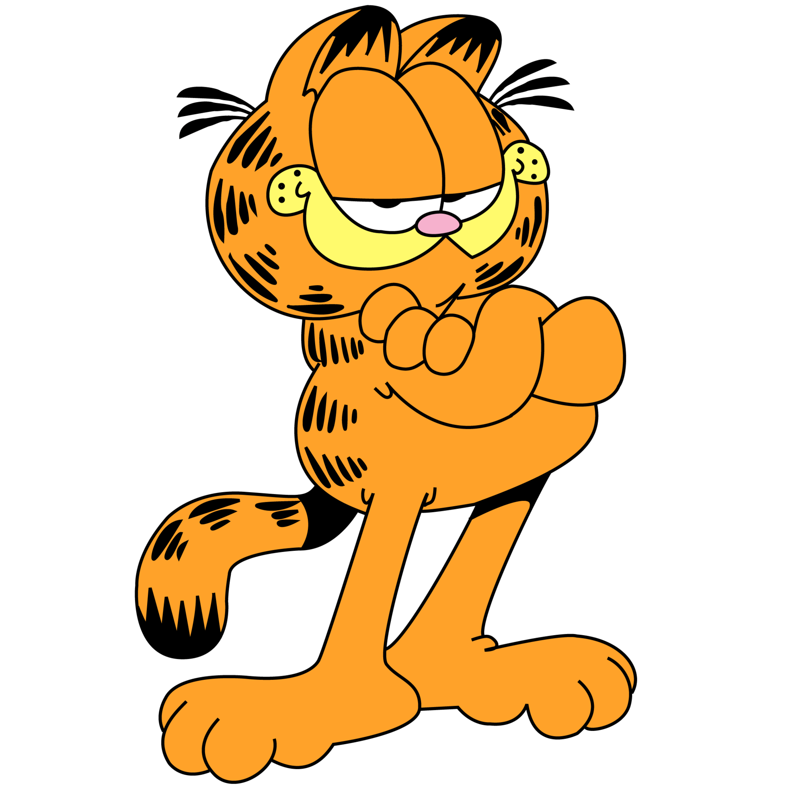

<h1 align="center" id="title">GarFood</h1>



<p id="description">GarFood is a game where Garfield the cat tries to collect as much fish as he can while avoiding the neighborhood dogs to reach the finish line where he'll enjoy all the fish he collected.</p>

<h2>💻 Built with</h2>

<div align="center">
	<code></code>
	<code></code>
	<code></code>
	<code></code>
<code></code></div>

Technologies used in the project:

* C++
* OpenGL
* glm
* GLFW
* CMake

<h2>🛠️ Installation Steps:</h2>

<p>1. Build using CMake</p>

<p>2. Run game executable</p>

```
../bin/GAME_APPLICATION.exe
```

<h2> 🎥 Demo video </h2>

https://github.com/SarahElzayat/GarFood/assets/76779284/fb23bb29-ea13-4b69-aa75-82857a313f18

<h2> 👥 Collaborators </h2>

| [Sarah Elzayat](https://github.com/SarahElzayat) | **[Yasmine Ghanem](https://github.com/yasmineghanem)** | **[Yasmin ElGendi](https://github.com/YasminElgendi)** | **[Donia Gameel](https://github.com/DoniaGameel)** |
| --------------------------------------------- | --------------------------------------------------------- | --------------------------------------------------------- | ----------------------------------------------------- |
